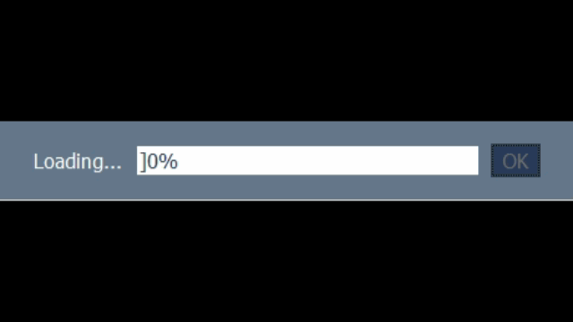

# Animated Popup
Animated PySimpleGUI popup screens for running processes. All of these can be run independent of other processes using multi-threading.

This popup is animated by iterating through a list of images  
  

This popup is animated with a simple sequence of text options in a while loop
  

This popup is animated by with simple ascii characters in a while loop  
  
